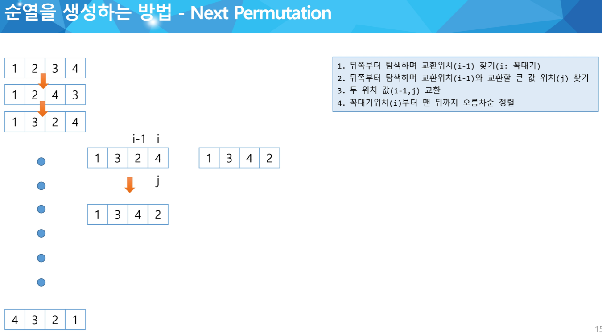

# 자료구조 구현 참고 사이트 https://bloodstrawberry.tistory.com/19
<br>


# 최소 힙 구현 POP 함수
```java
for (int i = 1; i * 2 <= hn;)
{
	/* 자식 node 모두 비교해서 자신이 작다면 우선순위를 만족 종료. */
	if (heap[i] < heap[i * 2] && heap[i] < heap[i * 2 + 1]) break;
	else if (heap[i * 2] < heap[i * 2 + 1]) /* 왼쪽 node가 더 작다면 */
	{
		tmp = heap[i * 2];
		heap[i * 2] = heap[i];
		heap[i] = tmp;

		i = i * 2;
	}
	else /* 오른쪽 node가 더 작다면 */
	{
		tmp = heap[i * 2 + 1];
		heap[i * 2 + 1] = heap[i];
		heap[i] = tmp;

		i = i * 2 + 1;
	}
}
```
## for (int i = 1; i * 2 <= hn;) 범위 설정
### 만약 i * 2 < hn으로 설정된다면, 즉 왼쪽 자식이 힙의 범위를 벗어나면 루프를 종료하게 됩니다. 
### 왜냐하면 왼쪽 자식이 없다는 것은 현재 노드 i가 리프 노드인 경우이기 때문에 더 이상 비교할 필요가 없기 때문입니다.
### 따라서 i * 2 <= hn은 현재 노드가 최소한 하나 이상의 자식을 가지고 있어야 한다는 조건을 나타냅니다.
참고 사이트 : https://bloodstrawberry.tistory.com/45
<br><br><br>
# Next Permutation


